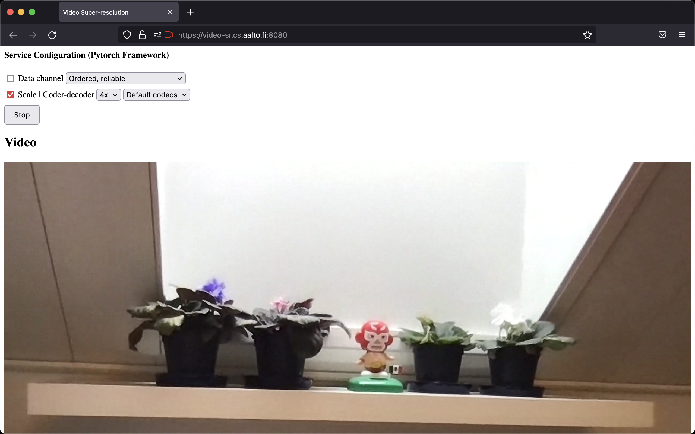

# Real-Time-Video-Super-Resolution-Service

## Introduction

<p align="center">
    
</p>

Despite the advancements in video streaming, we still find limitations when there is the necessity to stream real-time video in a higher resolution (e.g., in super-resolution) through mobile devices with limited resources. This thesis work aims to give an option to address this challenge through a cloud service.

There were two main code components to create this service. The first component was aiortc (e.g., the WebRTC python version), the streaming protocol. The second component was the Efficient Sub-Pixel Convolutional Neural Network (ESPCN)-model, one of the outstanding methods to upscale video at the present time. These two code components were implemented in a virtual machine in the Microsoft Azure cloud environment with a customized configuration.

Qualitative as well as quantitative results of this work were obtained and analysed. To obtain the qualitative results two versions of the ESPCN-model were developed and for the quantitative outcomes three different configurations of HW/SW codecs and CPU/GPU utilisation were produced and analysed.

Besides finding and defining the code components mentioned before as optimal to create an efficient real-time video super-resolution service based on the cloud, another conclusion of this project is that sending or receiving information (frames) from the CPU to the GPU and  vice-versa has a very big negative impact in the efficiency of the whole service. Hence, to limit this CPU-GPU interaction or to only use GPU (e.g., with the NVIDIA Virtual Processing Framework [VPF]) is critical for an efficient service. This issue can be avoided, as the quantitative results show, if a codec that only makes use of the GPU (e.g., a NVIDIA HW codec) is employed. Furthermore, the Azure cloud environment component, enables an efficient execution of the service in diverse mobile devices.

In future, the quality measure of the video super-resolution done by the ESPCN-model is suggested as a next step to do.

## Updates
- [2022-01-06] v0.1 is released.

## License
The project is release under the [MIT license](./LICENSE).

## Contact
For any question, feel free to contact
```
AMEZCUA Luis     : luis.amezcua@aalto.fi
```
